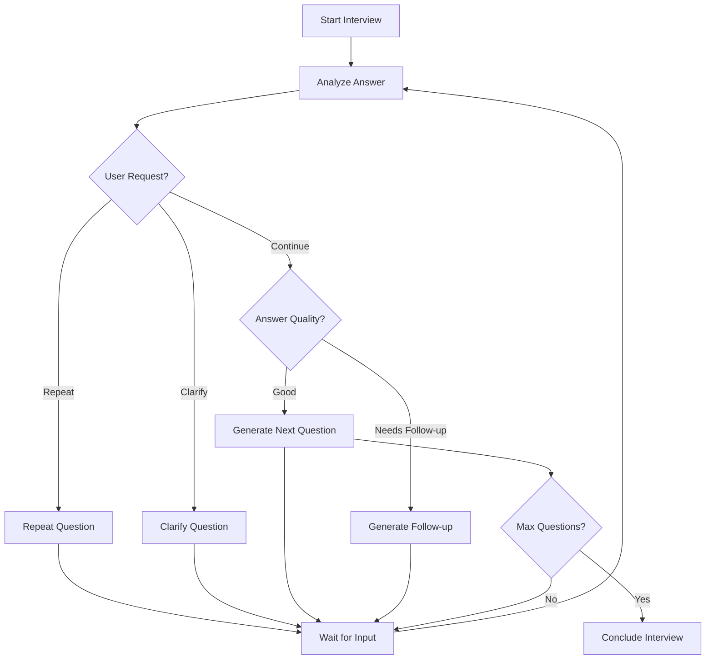

# 🚀 AI-Powered Interview Agent

## 🏁 How to Run This Program (Quick Start)

1. **Clone the repository**
   ```bash
   git clone https://github.com/your-username/ai-interview-agent.git
   cd ai-interview-agent
   ```
2. **Install all dependencies**
   ```bash
   npm run install:all
   ```
3. **Set up environment variables**
   - Copy `.env.example` to `.env` in `/server` and `.env.local` in `/client` (see below for details)
   - Add your AI API key(s) if available (Google Gemini recommended for free tier)
4. **Start the development servers**
   ```bash
   npm run dev
   ```
   - This will start both the backend (http://localhost:5000) and frontend (http://localhost:3000)
5. **Open your browser**
   - Go to [http://localhost:3000](http://localhost:3000) to use the app

**Troubleshooting:**
- If you see connection errors, make sure both client and server are running and the ports match your `.env` files.
- If you have no AI API key, the app will use fallback responses (still works for demo/testing).
- For voice features, use Chrome or a modern browser and allow microphone access.

---

A stunning, production-ready AI interview system built with Next.js, LangGraph, and real-time communication. Experience the future of interviews with intelligent AI that adapts to your responses and provides real-time feedback.

   

## ✨ Features

### 🎯 **Intelligent Interview Flow**
- **Adaptive Questioning**: AI dynamically generates questions based on your responses
- **Multi-Phase Structure**: Introduction → Technical → Behavioral → Closing
- **Context-Aware**: Remembers previous answers and builds upon them
- **Real-Time Evaluation**: Instant feedback on answer quality and key points

### 🎨 **Stunning User Interface**
- **Modern Dark Theme**: Beautiful gradient backgrounds with glass morphism effects
- **Smooth Animations**: Framer Motion powered transitions and micro-interactions
- **Responsive Design**: Perfect experience on desktop, tablet, and mobile
- **Voice Visualizations**: Real-time audio waveforms and speaking indicators

### 🎤 **Advanced Voice Integration**
- **Speech-to-Text**: High-accuracy voice recognition with confidence scoring
- **Text-to-Speech**: Natural AI voice responses with customizable settings
- **Voice Commands**: "Repeat question", "Clarify", and more
- **Audio Feedback**: Visual indicators for recording and playback

### 🤖 **AI-Powered Intelligence**
- **Multiple AI Providers**: Google Gemini, OpenAI, and OpenRouter support
- **Intelligent Routing**: LangGraph manages complex conversation flows
- **Fallback Responses**: Graceful degradation when AI services are unavailable
- **Smart Evaluation**: Detailed analysis of answer quality and suggestions

### 🔄 **Real-Time Communication**
- **Socket.io Integration**: Instant message delivery and status updates
- **Live Progress Tracking**: Visual progress bars and phase indicators
- **Session Management**: Robust handling of connections and disconnections
- **Error Handling**: Comprehensive error recovery and user feedback

## 🛠️ Tech Stack

### Frontend
- **Next.js 14** - React framework with App Router
- **TailwindCSS** - Utility-first CSS framework
- **Framer Motion** - Production-ready motion library
- **Socket.io Client** - Real-time communication
- **Web Speech API** - Voice recognition and synthesis

### Backend
- **Node.js & Express** - Server runtime and web framework
- **Socket.io** - WebSocket server for real-time communication
- **LangGraph** - AI workflow orchestration
- **LangChain** - AI model integration and tooling

### AI Integration
- **Google Gemini** - Primary AI model (free tier available)
- **OpenAI GPT** - Alternative AI provider
- **OpenRouter** - Multiple model access point

## 🎮 Usage Guide

### Starting an Interview

1. **Profile Setup**: Enter your name, position, and experience level
2. **Skills Selection**: Choose from 20+ predefined skills or add custom ones
3. **Interview Launch**: Click "Start Interview" to begin your session

### During the Interview

- **Text Input**: Type responses in the chat interface
- **Voice Input**: Click the microphone button to speak your answers
- **Quick Actions**: Use "Repeat Question" or "Need Clarification" buttons
- **Progress Tracking**: Monitor your progress through the interview phases

### AI Features

- **Intelligent Questions**: AI generates relevant questions based on your profile
- **Real-Time Feedback**: Get instant evaluation of your responses
- **Adaptive Flow**: Questions adapt based on your answer quality
- **Voice Interaction**: Natural voice conversations with the AI interviewer

## 🎯 Interview Structure

### Phase 1: Introduction (Questions 1-4)
- Personal background and motivation
- Career goals and aspirations
- Company knowledge and interest

### Phase 2: Technical (Questions 5-8)
- Skills and technology experience
- Problem-solving scenarios
- Project discussions

### Phase 3: Behavioral (Questions 9-12)
- Teamwork and collaboration
- Leadership and conflict resolution
- Adaptability and learning

### Phase 4: Closing (Questions 13-15)
- Questions about the role/company
- Availability and expectations
- Final thoughts and wrap-up

## 🔧 API Endpoints

### Health Check
```
GET /health
Response: {"status": "OK", "message": "Interview Agent Server is running"}
```

### Socket Events

**Client → Server:**
- `startInterview` - Begin new interview session
- `userMessage` - Send user response
- `endInterview` - Terminate interview
- `getInterviewStatus` - Get current session status

**Server → Client:**
- `interviewStarted` - Interview initialization complete
- `agentResponse` - AI response with question/feedback
- `interviewCompleted` - Interview finished
- `error` - Error notifications

## 🎨 UI Components

### WelcomeScreen
- Multi-step onboarding process
- Animated background effects
- Skill selection interface
- Profile customization

### InterviewInterface
- Real-time chat interface
- Voice control integration
- Progress visualization
- Sidebar statistics

### ChatMessage
- Bubble-style message display
- AI evaluation badges
- Timestamp and status indicators
- Smooth animations

### VoiceControls
- Recording state visualization
- Confidence scoring display
- Error handling and feedback
- Audio level indicators

## 🔄 LangGraph Workflow

The AI interview flow is managed by a sophisticated LangGraph implementation:



## 🚨 Error Handling

### AI Service Fallbacks
- Primary: Google Gemini API
- Secondary: OpenAI GPT models
- Fallback: Pre-defined response templates

### Connection Recovery
- Automatic reconnection attempts
- Session state preservation
- Graceful degradation of features

### Voice Recognition
- Microphone permission handling
- Browser compatibility checks
- Audio quality monitoring

## 🌟 Advanced Features

### Real-Time Analytics
- Answer quality scoring (1-10)
- Key point extraction
- Response time tracking
- Phase completion rates

### Customization Options
- Interview duration settings
- Question pool management
- AI model selection
- Voice preferences

### Session Management
- Multi-user support
- Session persistence
- Interview history
- Export capabilities

## 📱 Browser Compatibility

- **Chrome 80+** ✅ (Recommended)
- **Firefox 75+** ✅
- **Safari 14+** ✅
- **Edge 80+** ✅

**Note**: Voice features require HTTPS in production

## 🔒 Security & Privacy

- No audio data is stored permanently
- Session data is encrypted in transit
- API keys are securely managed
- CORS protection enabled

## 🚀 Deployment

### Production Build
```bash
npm run build
npm start
```

### Environment Variables (Production)
- Set `NODE_ENV=production`
- Configure proper `CLIENT_URL`
- Use production AI API keys
- Enable HTTPS for voice features

### Docker Support
```dockerfile
# Dockerfile example
FROM node:18-alpine
WORKDIR /app
COPY package*.json ./
RUN npm install
COPY . .
RUN npm run build
EXPOSE 3000 5000
CMD ["npm", "start"]
```

## 🤝 Contributing

1. Fork the repository
2. Create a feature branch (`git checkout -b feature/amazing-feature`)
3. Commit your changes (`git commit -m 'Add amazing feature'`)
4. Push to the branch (`git push origin feature/amazing-feature`)
5. Open a Pull Request

## 📄 License

This project is licensed under the MIT License - see the [LICENSE](LICENSE) file for details.

## 🆘 Support

- **Documentation**: Check this README and inline code comments
- **Issues**: Use GitHub Issues for bug reports and feature requests
- **Discussions**: Join GitHub Discussions for community support

## 🙏 Acknowledgments

- **LangChain Team** - For the amazing AI framework
- **Vercel** - For Next.js and development tools
- **OpenAI/Google** - For AI model access
- **Framer** - For the motion library
- **TailwindCSS** - For the styling framework

---

**Built with ❤️ for the future of interviews**

*Experience the next generation of interview preparation with AI-powered intelligence, real-time feedback, and stunning user experience.*